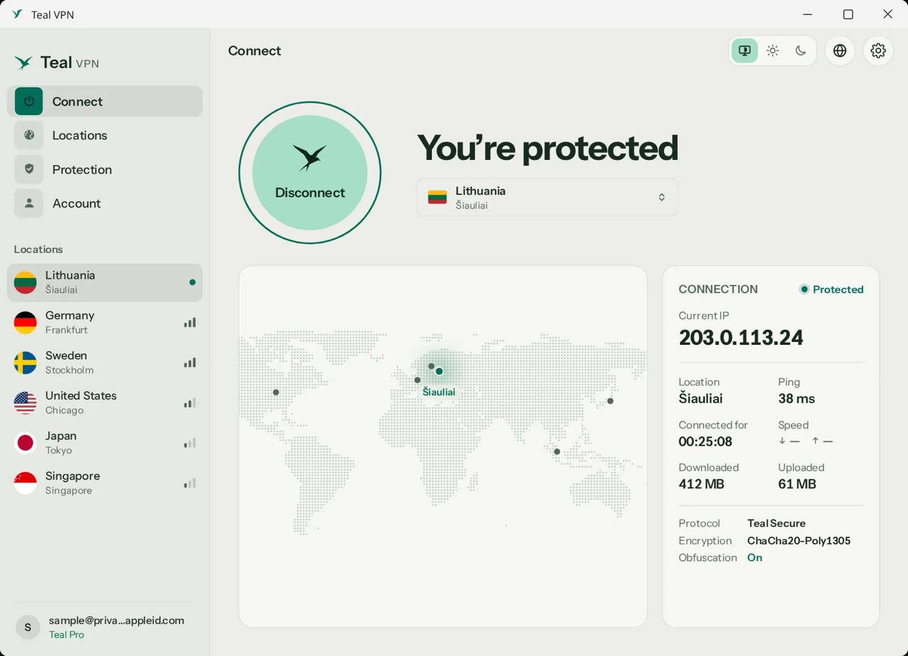
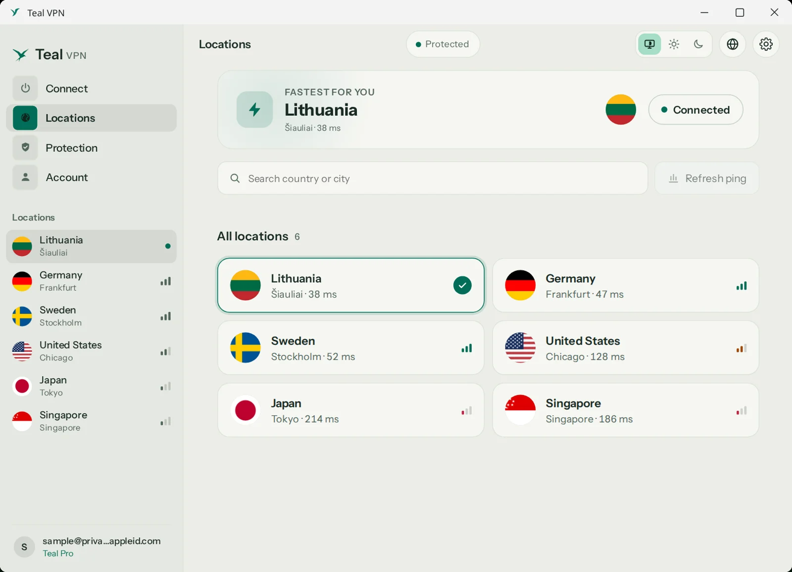
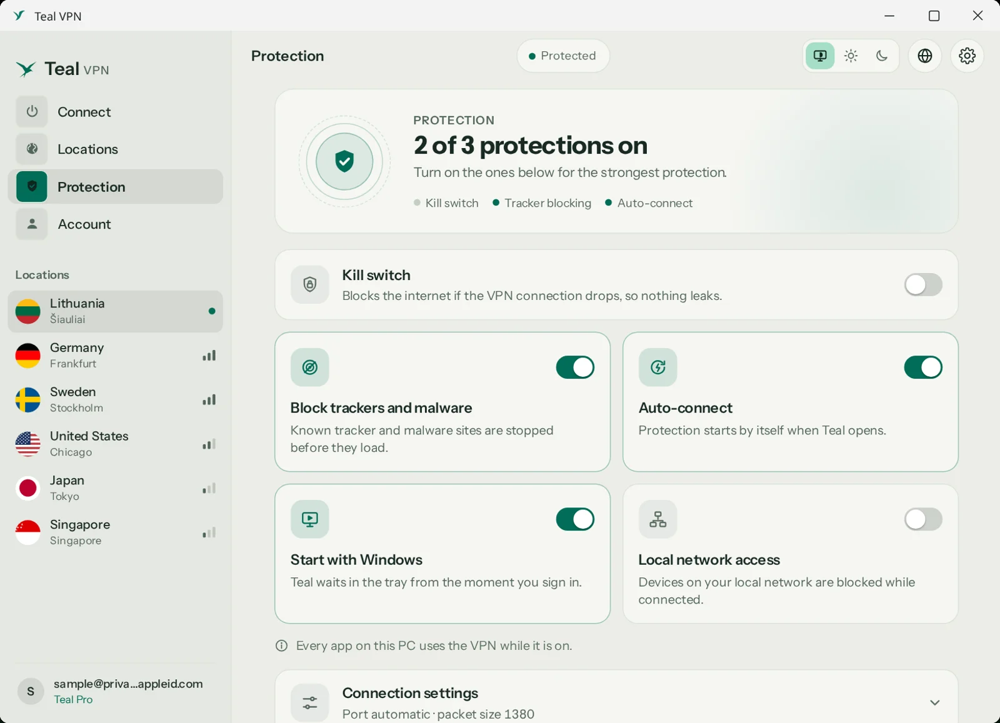

# Teal VPN for Windows

Teal VPN is a private VPN that is built to connect on networks that block VPNs. Teal Free gives you a daily data
allowance with no card and no ads. Teal Pro is unlimited and opens every location.

This page hosts the **direct download** of the Teal VPN installer for Windows 10 (version 1809 or newer) and
Windows 11. The installer is digitally signed by us. This repository holds no source code, only the releases.

## Screenshots

  

## Download

- **Intel / AMD PCs (most PCs):** [TealVPN-Setup-x64.exe](https://github.com/tealvpn/windows/releases/latest/download/TealVPN-Setup-x64.exe)
- **ARM PCs (Snapdragon, Surface Pro X):** [TealVPN-Setup-arm64.exe](https://github.com/tealvpn/windows/releases/latest/download/TealVPN-Setup-arm64.exe)

Every version is on the [Releases](https://github.com/tealvpn/windows/releases) page.

## Install

1. Open the downloaded installer. If Windows says "Windows protected your PC", click **More info**, check that the
   publisher is the one named on [tealvpn.com/windows](https://tealvpn.com/windows), then **Run anyway**.
2. Allow the one Windows prompt (the VPN service needs administrator rights to install).
3. Sign in and press **Connect**.

## Check the file (SHA-256)

Each release lists the files' SHA-256 and carries a `.sha256` file for each installer. Compare it with your download:

- Windows: `certutil -hashfile TealVPN-Setup-x64.exe SHA256`
- Linux / Mac: `sha256sum -c TealVPN-Setup-x64.exe.sha256`

The app updates itself and checks the signature before installing an update.

## Official links

- Website: https://tealvpn.com
- Windows: https://tealvpn.com/windows
- Your account: https://account.tealvpn.com
- Help: support@tealvpn.com

Download Teal VPN only from tealvpn.com or this page.
